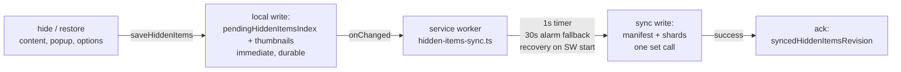

# Architecture

## Surfaces

Four extension surfaces share one storage abstraction — every hidden-item
read/write goes through `src/shared/hidden-items.ts`; no surface touches
storage keys directly:

- `src/content/` — eBay search results and item pages (hide/restore UI)
- `src/pages/popup/`, `src/pages/options/` — count, list, restore, clear
- `src/background/` — service worker: badge, alarms, sync coordinator

## Hidden-items storage pipeline

| Area | Keys | Role |
|---|---|---|
| `local` | `thumbnails` | Device-local thumbnail URLs (never synced) |
| `local` | `pendingHiddenItemsIndex` | `{revision, index}` — the newest hide list awaiting sync |
| `local` | `syncedHiddenItemsRevision` | Ack of the last revision successfully written to sync |
| `sync` | `hiddenItemsIndexManifest` | `{revision, shardCount}` — read pointer for shards |
| `sync` | `hiddenItemsIndex:<n>` | Shards of the index (everything but `thumbnail`), each ≤ 8 KB |

### Write path

1. Any hide/restore writes the full split state to `local` immediately —
   the caller's context may die right after and nothing is lost.
2. The coordinator coalesces on a 1 s timer (rapid hides collapse to one
   sync write). A one-shot 30 s named alarm is the durable fallback; it is
   deliberately left armed after a successful timer flush, and module
   evaluation on every SW start recovers outstanding pending data.
3. A flush writes manifest + shards in a single `sync.set`, then acks the
   revision. A newer pending revision that arrived mid-flight stays
   outstanding and re-schedules.

### Read path

`loadHiddenItems` returns the **pending** index when its revision is newer
than the acked one, else the **synced** index; thumbnails are joined from
`local` (missing → empty string). `watchHiddenItems` fires on sync-manifest
changes (remote devices) and local pending changes (this device).

### Conflict semantics

Whole-list last-write-wins across devices — see
[ADR 0001](./adr/0001-hidden-items-sync-durability.md) for the durability
rationale and rejected alternatives.
